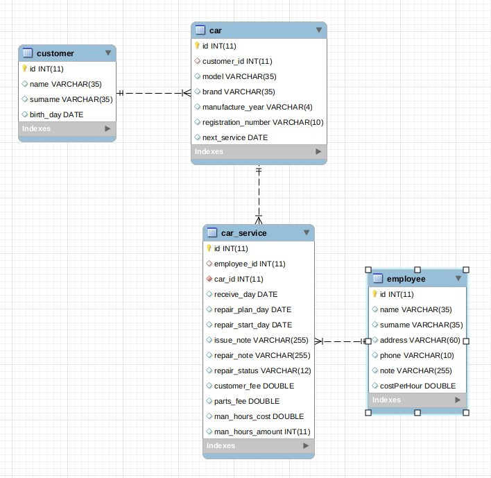

# Car Shop CRM

The aim of this project is to design a CRM system for a Car Shop.

### The APP

* integrate database with OOP model
* use Servlets and JSPs
* DAO - access data
* DriverManager connection
* MVC
* CRUD

### Functionality

Customers Management:
    
    * add / update / delete / customer preview
    
Cars Management:
    
    * add / update / delete / car preview / car assignment to customer
    
Employees Management:
    
    * add / update / delete / employee preview / reviewing employee orders
    
Car Repairs Management:
    
    * add / update / delete / status / details
    
### Views

Main Page

    navigation panel
    
Customer Page

    customer list - details list
    
Orders Page

    cars under repair - details - employees
    
Employee Page

    employees list - details - employee orders
    
Reports

    P&L Report - number of man-houers

### Entities - DATA SCHEMA

* CUSTOMER
* CAR
* CAR_SERVICE
* EMPLOYEE

